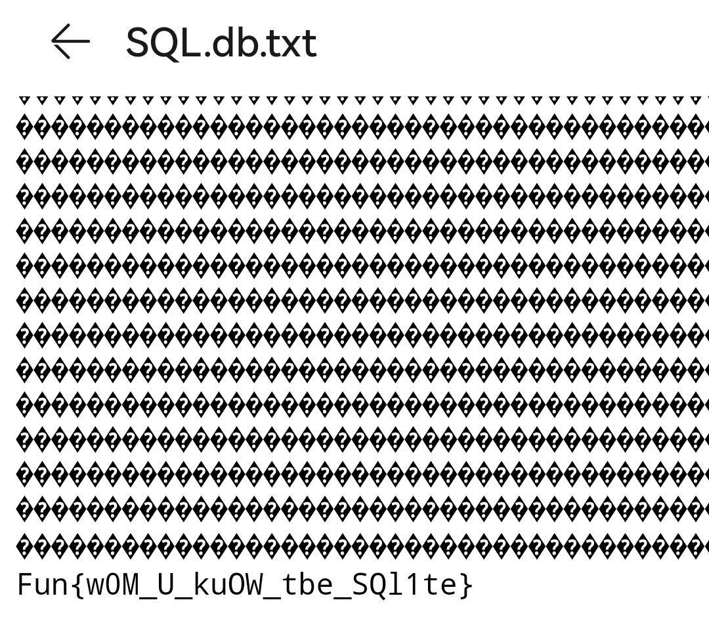

# ZFun 2023 Writeup --password123

*为什么叫password123?详见ZFun2022*

## 写在开头

本来不准备写wp(毕竟做的挺差的)，但是受~~出题人之一~~朋友[@APP1223](https://github.com/1223APP)~~要求~~邀请，就来写一下

反正我这次题目很多都是走漏洞~~txt~~，有些现在都不懂预期解法，所以内容不建议认真读，~~(顺便庆幸一下一些主要对手被抓去出题了)~~

编写格式借鉴了去年[@Yang](https://github.com/Yang-Fly)的[wp](https://github.com/NoSparkHere/ZFun2022/blob/main/WriteUp/Yang/README.md)

## tutorial

### [送分题](https://github.com/NoSparkHere/ZFun2023/tree/main/problems/signin)

都说了是送分题了，复制粘贴即可

### [四大名著](https://github.com/NoSparkHere/ZFun2023/tree/main/problems/mingzhu)

下载是个txt，鉴于flag的格式，直接查找ZFun，跟着的就是flag了

~~当然可以慢慢读，提示个人文学素养~~

### [Welcome to Minecraft](https://github.com/NoSparkHere/ZFun2023/tree/main/problems/minecraft)

是个mod，正解应该是导入mc，由于本人电脑内存不足(才1GB)，所以选择做为zip打开，最终在/net/mcreator/zfun/procedures/SendflagProcedure.class中找到了flag

## basic

### [550W](https://github.com/NoSparkHere/ZFun2023/tree/main/problems/550w)

经典摩斯电码，随便找个在线工具直接翻

### [凡有所相，皆是虚妄！](https://github.com/NoSparkHere/ZFun2023/tree/main/problems/buddha)

曾经红极一时的与佛论禅密码，但现在大多是重制的，找到原版略微困难

(这个或许能用：https://github.com/playGitboy/YuFoLunChan)

### [[]（）+!Script](https://github.com/NoSparkHere/ZFun2023/tree/main/problems/jscript)

Jsfuck，一种加密方式，可以直接找解密工具(如http://www.liminba.com/tool/jsfuckdecode/)

也可以直接在线编译(如https://www.wetools.com/js-run)

### [食我闪光弹](https://github.com/NoSparkHere/ZFun2023/tree/main/problems/extension)

像不像去年的[让我康康](https://github.com/NoSparkHere/ZFun2022/tree/main/Misc/%E8%AE%A9%E6%88%91%E5%BA%B7%E5%BA%B7%EF%BC%81)？但不是！~~它才100分而已~~

只要将拓展名改为txt，就会发现这张图片中的flag.txt。这不压缩包吗？于是改为zip，顺利获得flag


### [ZFun2023宣传幻灯片](https://github.com/NoSparkHere/ZFun2023/tree/main/problems/powerpnt)

**首先，~~众所周知~~ppt是可以作为zip打开的**

#### 深藏的

正解：打开ppt，转备注页，拉到最底下即可获得flag

~~抄近道：解压整个ppt，建立Dreamweaver站点，批量查找，速度极快~~

#### 遗忘的

之所以打开会报错，就是zip里多了个flag.txt，在打开ppt前先作为zip打开就好了

~~当然批量查找仍然适用。一次查找出两个flag，谁不爱呢~~

~~话说这题是不是和上题闪光弹出串了~~

### [菲林问答 Season 2](https://github.com/NoSparkHere/ZFun2023/tree/main/problems/FelineQuiz2)

不同的题目，不变的~~搜索引擎~~情怀

#### 1 github二次元gcc编译器

幸运的，结果第一个就是


#### 2 键盘windows徽标键出现年份

这个比较靠下，在搜狐里


#### 3 win10快捷键手动蓝屏状态码

又是第一个的结果，只不过在整篇文章中靠下


#### 4 mygo水族馆原型

还是第一个。。等等，答案不正确？


找到[本家网站](https://sunshinecity.jp/aquarium/)，顺利获得全名


#### 5 B站宋浩av号

直接在B站找宋浩，随便点开一个视频，分享，在分享码中找出av号


#### 6 Concat Notation 之方纸箱内探头猫猫

查找Concat Notation，找到[RFC9402](https://www.rfc-editor.org/rfc/rfc9402.html)，不看前面理论，直接拉到底看示例，然后照猫画虎即可


~~什么，别告诉我你不会网页翻译~~

## advanced

### [B.B.K.K.B.K.K.](https://github.com/NoSparkHere/ZFun2023/tree/main/problems/bbkkbkk)

看内容，全是bass和kick，联想到二进制，每行8个，整齐划一，进而联想到unicode。最后，用在线工具翻一下就好了。~~哪个是0？都蒙一遍就好了~~

### [SQL](https://github.com/NoSparkHere/ZFun2023/tree/main/problems/sql)

你觉得数据库通常是以什么形式存在的呢？

~~我觉得数据库可以以txt形式存在~~



~~别问，问就是不会~~

### [Unlocked ZIP](https://github.com/NoSparkHere/ZFun2023/tree/main/problems/unlocked_zip)

都提示到这份上还做不出来？

根据题意，这个zip根本没加密。于是上网查找伪加密相关资料，使用winhex更改字节，~~实际上并不~~顺利地打开zip

### [NTFS](https://github.com/NoSparkHere/ZFun2023/tree/main/problems/ntfs)

上网查找，发现NTFS有个交换数据流~~然后我就不会了~~

~~你问我我怎么做？那当然是txt。就问你是不是能做出来吧~~

### [挖狗](https://github.com/NoSparkHere/ZFun2023/tree/main/problems/digdog)

首先，这题我没做出来。~~谁知道题目意思是digdog啊，我都搜挖狗搜到娱乐圈了~~

按照题目域名，去查域名的txt记录就好

至于digdog，是两种dns解析工具，即dig和dog~~会起名的~~

### [Where is the flag](https://github.com/NoSparkHere/ZFun2023/tree/main/problems/where_is_the_flag)

物理世界有监控，信息世界怎么能没有呢~

**使用监控程序process monitor，添加筛选条件为进程名where_is_the_flag.exe**，即可监视该程序一举一动，小到**创建文件**大到篡改系统，都躲不过你的眼睛！

~~当然，对于篡改系统，他能做的也只有看着~~

### [DLL](https://github.com/NoSparkHere/ZFun2023/tree/main/problems/dll)

和SQL差不多，这次我选择VScode

### [TanChiShe](https://github.com/NoSparkHere/ZFun2023/tree/main/problems/tanchishe)

~~贪吃蛇？还两百分？！哦网页啊，那没事了~~

当网页与服务器交流时，会发出请求。一般情况下，如果flag在服务器，那么请求就是得分了

我用的是Fiddler，开了贪吃蛇就等请求，等了几把，一个请求也没有。自我怀疑，打一把试试，结果五分就噶了。结果不坏，至少请求出现了(原来得分了才会发请求)

允许编辑请求，把5改成200，重新发送即可得到flag

### [情怀如 SSTV](https://github.com/NoSparkHere/ZFun2023/tree/main/problems/sstv)~~ZFeng乐开花~~

这道题我也没做出来~~事实上只差一两步~~

首先，下载原音乐，下载~~污染~~混合音乐，用音乐处理软件(如Au)从混合音乐去除原音乐，即可得到[~~高糊~~杂音](assets/sstv.wav)(记得先把原音乐换成一样的频率格式**尤其是声道**再另存，要不然杂音提不干净)(出题人甚至贴心反相好了)

败就败在这，sstv已经指向很明显了，百度即可，抄录出图片再扫码就能得到flag。我却误以为在玩cctv的梗，不予理会

~~得不到的就更加爱，太容易得到就不理睬~~

附上sstv抄录出的图


## [algorithm 在线测评题目](https://github.com/NoSparkHere/ZFun2023/tree/main/problems/algorithm_problems)

个人变量更喜欢用拼音，~~通俗易懂~~

### 1 斐波那契的复仇

没什么好说的，数学课本和编程书混了()

```
i=int(input())
a,b=0,1
for p in range(0,i):
    n=int(input())
    for q in range(2,n+1):
        a,b=b,a+b
    print(b)
    a,b,n,p=0,1,0,0
```

### 2 高效删除与无脑排序（？

初版代码忘了，这是我交的终版，思路就是把输入的str先分割再去重最后排序

```
print(''.join(sorted(set(input()))))
```

### 3 逆波兰表达式

先把输入分割，再分开数字和运算符，若是数字就扔进结果列，是运算符就将结果列前两个项进行运算再返回

```
a=input()
nbb=input()
ysf=['+','-','*','/']
fgl=nbb.split()
jg=[]
for fgx in fgl:
    if fgx not in ysf:
        jg.append(int(fgx))
    else:
        b=jg.pop()
        a=jg.pop()
        if fgx=='+':
            jg.append(a+b)
        elif fgx=='-':
            jg.append(a-b)
        elif fgx=='*':
            jg.append(a*b)
        else:
            jg.append(int(a/b))
print(jg[0])
```

### 4 祥子别哭

~~思路有亿点混乱且~~其中部分分部借助了科技(glm)的力量(以下会注明)

~~有一说一，这家伙不是很靠谱~~

```
aa=[]
bb=[]
cc=[]
n,m=map(int,input().split())
for i in range(n):
#a,b,c对应c,p,t组成列
    a,b,c=map(int,input().split())
    aa.append(a)
    bb.append(b)
    cc.append(c)
#d为每体力威力，其中无限为-1
dd=[]
#排查特殊情况：不耗体力或没有威力
for a,b in zip(aa,bb):
    if b==0:
        d=0
    elif a==0:
        d=-1
    else:
        d=b/a
    dd.append(d)
#将c,p,t,d按d的大小降序，其中d=-1排在最前
#此分部采用chat glm制作
alll=list(zip(aa,bb,cc,dd))
def px(m):
    d=m[3]
    return (d!=-1,d)
pxall=sorted(alll,key=px,reverse=True)
aa,bb,cc,dd=zip(*pxall)
#按照剩余体力是否足够与t是否为1顺序求出威力最值
pm=0
for a,b,c,d in zip(aa,bb,cc,dd):
    if d==-1:
        pm+=b
    elif c==1:
        if m>=a:
            pm+=b
            m-=a
    else:
        while m>=a:
            pm+=b
            m-=a
print(pm)
```

## security

### [“静态”文件服务](https://github.com/NoSparkHere/ZFun2023/tree/main/problems/vulnfs)

~~没有提示我不会做，有了提示我照样没做出来~~

刚开始，看到能访问任意文件，便以为是扫描(实际上也这么去试了，换着不同字典扫了几遍没扫出来就放弃了)~~(我感觉我当时和滞涨一样)~~

看到提示，果断../flag.txt，没东西，又放弃了

~~看到答案是../../flag.txt，我感觉我更滞涨了~~

总之，答案地址在https://vulnfs-*.zfun.woooo.tech/?file_path=../../flag.txt

### [盒打击已就绪 2](https://github.com/NoSparkHere/ZFun2023/tree/main/problems/osint_ready)

~~和去年题目如出一辙~~

先看图，长沙南站，有人没上车，说明不是终点站，站台表上快整点了，旁边列车五点多一点发车，推测时间在四点五十几。图片属性和推测一致。(为什么不直接看属性？因为~~我没注意~~属性能改)

接着找[长沙南站时刻表](https://qq.ip138.com/train/hunan/changshanan.htm)，太乱了，导入excel，按长沙南站发车时间排序，蒙四五个，就中了

最后，是南宁东到上海虹桥的G1506

### [It's My__!!!!!](https://github.com/NoSparkHere/ZFun2023/tree/main/problems/its_my)

~~好好好，隐写，对标去年是吧~~

我用的stegsolve，打开图片，在底下按箭头，按出来这个，这不妥妥的二维码吗


类似的手法，再按出一个较为明确的二维码，拼接出一个更清晰的二维码()


和原图拼接在一起，又是一个看不清的二维码


最后，再按几下箭头，即可得到清晰二维码


扫出来是串乱码，试试各种解码，最后试出来是base64

### [一键日卫星（ver.PHP）](https://github.com/NoSparkHere/ZFun2023/tree/main/problems/yjrwx)

~~看我干嘛，我脑子里有方法吗~~

反正是不会，提示里的文章有些看不懂，群里的大神解法也不理解，估计以后也会不了了

## 结语

你以为是个很有感情的结语？不，我只想看看这次能txt多少分()

|题目|分数|
|------|---|
|送分题|50|
|四大名著|50|
|Welcome to Minecraft|50|
|ZFun2023宣传片|150|
|SQL|150|
|NTFS|200|
|Where is the flag|200|
|**总分**|**850**|

如有其他题目能用txt手撕，欢迎联系fjljxty@163.com
